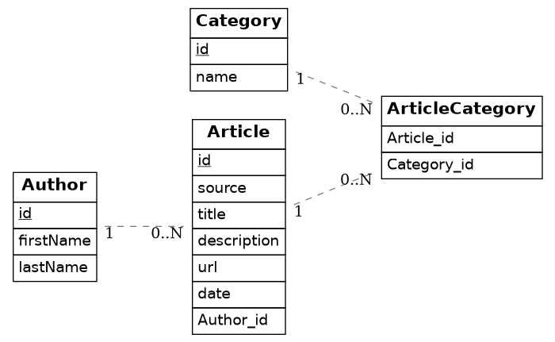
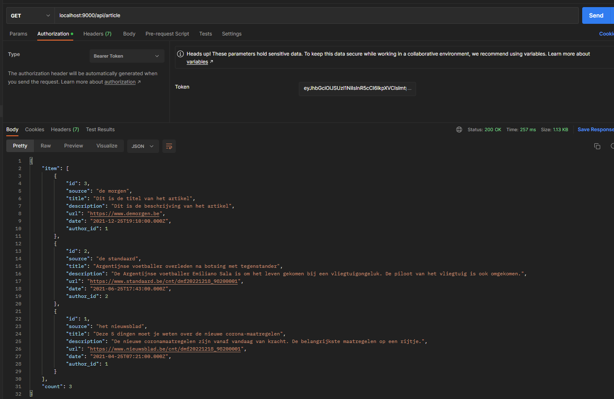
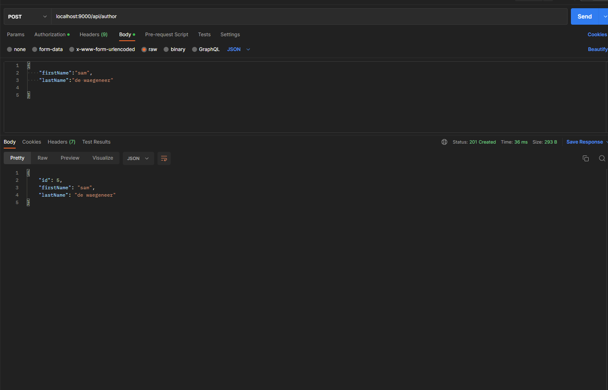
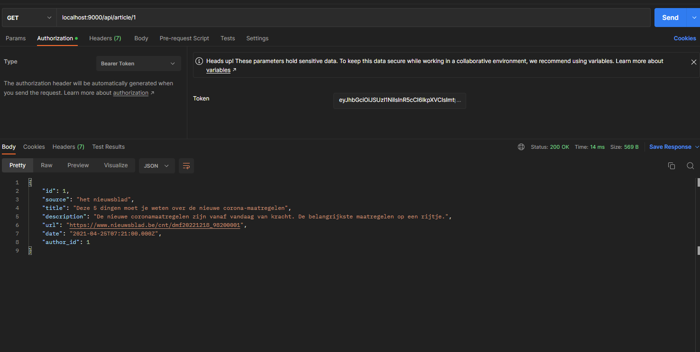
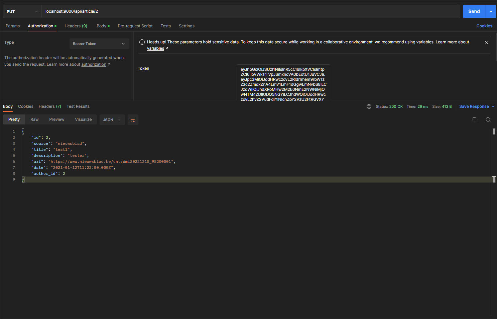
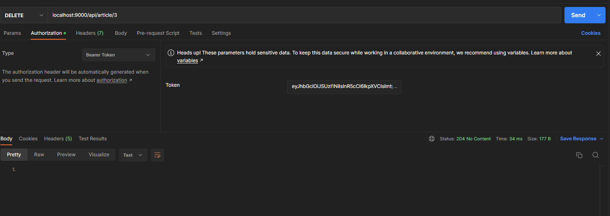
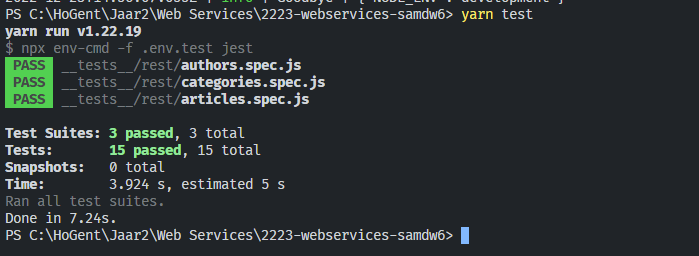
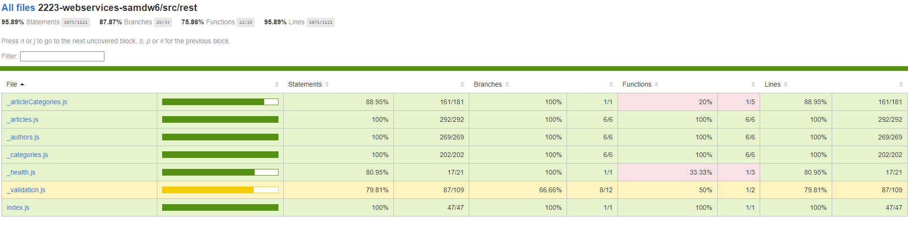

# Sam De Waegeneer (202183489)

> Duid aan welke vakken je volgt en vermeld voor deze vakken de link naar jouw GitHub repository. In het geval je slechts één vak volgt, verwijder alle inhoud omtrent het andere vak.
> Verwijder alle instructies (lijnen die starten met >)

- [x] Web Services: GITHUB URL
  - [GitHub repository](https://github.com/Web-IV/2223-webservices-samdw6.git)
  - [Online versie](https://two223-webservices-samdw06.onrender.com)

**Logingegevens**

- Gebruikersnaam/e-mailadres: abc@gmail.com
- Wachtwoord: Server*123

## Projectbeschrijving

 Mijn project is een artikel API. Een auteur heeft artikels geschreven die tot een bepaalde categorie behoren. <br />
  De auteur kan zijn artikels beheren en de categorieën beheren. <br />
  

## Screenshots

- vraag alle artikels op
  
- maak een auteur aan
  
- vraag een artikel op per id
  
- update een artikel
  
- delete een artikel
  

## Behaalde minimumvereisten

### Web Services

- **datalaag**

  - [x] voldoende complex (meer dan één tabel)
  - [x] één module beheert de connectie + connectie wordt gesloten bij sluiten server
  - [x] heeft migraties
  - [x] heeft seeds
<br />

- **repositorylaag**

  - [ ] definieert één repository per entiteit (niet voor tussentabellen) - indien van toepassing
  - [x] mapt OO-rijke data naar relationele tabellen en vice versa
<br />

- **servicelaag met een zekere complexiteit**

  - [x] bevat alle domeinlogica
  - [x] bevat geen SQL-queries of databank-gerelateerde code
<br />

- **REST-laag**

  - [x] meerdere routes met invoervalidatie
  - [x] degelijke foutboodschappen
  - [x] volgt de conventies van een RESTful API
  - [x] bevat geen domeinlogica
  - [x] degelijke authorisatie/authenticatie op alle routes
<br />

- **varia**
  - [x] een aantal niet-triviale testen (min. 1 controller >=80% coverage)
  - [x] minstens één extra technologie
  - [x] duidelijke en volledige `README.md`
  - [x] maakt gebruik van de laatste ES6-features (object destructuring, spread operator...)
  - [x] volledig en tijdig ingediend dossier

## Projectstructuur

### Web Services

- **2223-webservices-samdw6**
- __**tests**__
  - rest (testen van rest laag)
- **config** (configuratie bestanden voor omgevings variabelen)
- **src**
  - core (werking authorisatie, logging)
  - data (aanmaken databank instantie)
    - migrations
    - seeds
  - repository
  - rest (validatie en router paden definieren)
  - service (connectie databank en functies per tabel)

## Extra technologie

  De extra technologie die gebruikt werd in dit project is Swagger. Met swagger kan u de structuur van uw API beschrijven.

### Web Services

> Wat is de extra technologie? Hoe werkt het? Voeg een link naar het npm package toe!

## Testresultaten

### Web Services

- Artikel test of alle CRUD operaties mogelijk zijn bij een artikel en de link tussen artikel en categorie
- Auteur test of alle CRUD operaties mogelijk zijn voor een auteur
- Categorie test of alle CRUD operaties mogelijk zijn en de link tussen categorie en artikel

```yarn test```


```yarn test:coverage```


## Gekende bugs

### Web Services

/
